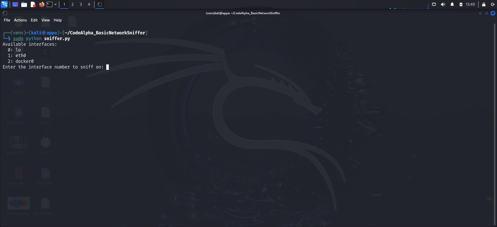
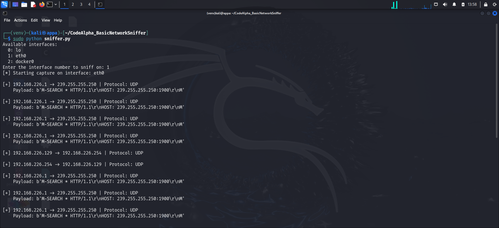

# Basic_Network_Sniffer (Python + Scapy)

This project demonstrates a simple yet powerful network sniffer written in Python using the Scapy library. It captures and analyzes live network traffic to display details such as source/destination IPs, protocols, and payload data.


## Features

- Live packet capture from a selected network interface
- Displays:
  - Source & Destination IP addresses
  - Protocol used (TCP/UDP/ICMP/etc.)
  - Packet payload (if available)
- Simple CLI-based interface
- Lightweight and easy to extend


## Project Structure

Basic_Network_Sniffer/
│
├── sniffer.py # Python script for sniffing and analyzing packets
├── README.md # Project documentation
└── screenshots/ # Screenshots showing output and code

## How It Works

1. Lists available network interfaces.
2. User selects an interface to sniff on.
3. Captures packets using Scapy's `sniff()` function.
4. For each packet, it extracts:
   - Source IP
   - Destination IP
   - Protocol
   - Payload (if present)
5. Outputs this information in real time.


## Screenshots

| Description                                      | Screenshot                                              |
|--------------------------------------------------|---------------------------------------------------------|
| Selecting network interface and starting capture |  |
| Real-time captured packet data                   |      |


## Requirements

- Python 3.x
- Scapy


## Installation

```bash
# Create and activate virtual environment
python3 -m venv venv
source venv/bin/activate

# Install dependencies
pip install scapy 

# Run with root privileges
sudo python sniffer.py
```

## Learning Outcome
- Understanding of packet-level data and network protocols
- Hands-on experience with Scapy and raw packet capture
- Built the foundation for more advanced network analysis tools

## Future Improvements

- Save packets to a file (PCAP)
- Add packet filtering (TCP only, port filters)
- Visualize traffic using graphs
- Detect suspicious patterns like port scanning

## License

This project is for educational and personal learning purposes.


